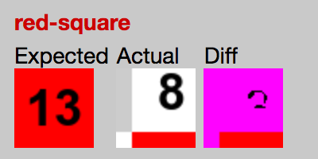

# Hermione capture screenshots of elements in iframe incorrectly

The problem is, that when you try to capture an element in iframe with `hermione#assertView`
the element coordinates doesn’t consider iframe position.

See [tests/iframe.hermione.js](./tests/iframe.hermione.js).



### Setup

```
npm install
```

### Reproduce

Capture screenshot of element in iframe when iframe is at 0,0 on page:

```
GRID_URL=http://localhost:4444 npm run nooffset
```

- [page preview](https://isqua.github.io/hermione-screenshot-iframe/test/nooffset/)
- [hermione report](https://isqua.github.io/hermione-screenshot-iframe/nooffset-report/index.html)

Capture screenshot of element in frame when iframe is shifted down:

```
GRID_URL=http://localhost:4444 npm run offset
```

- [page preview](https://isqua.github.io/hermione-screenshot-iframe/test/offset/)
- [hermione report](https://isqua.github.io/hermione-screenshot-iframe/offset-report/index.html)